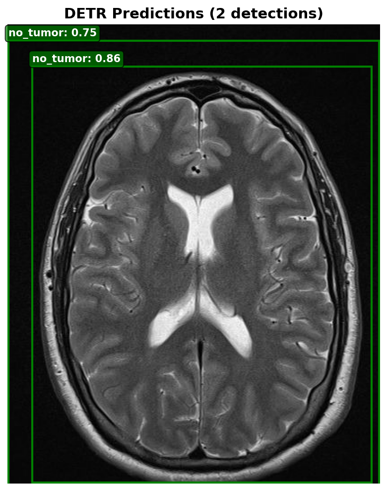
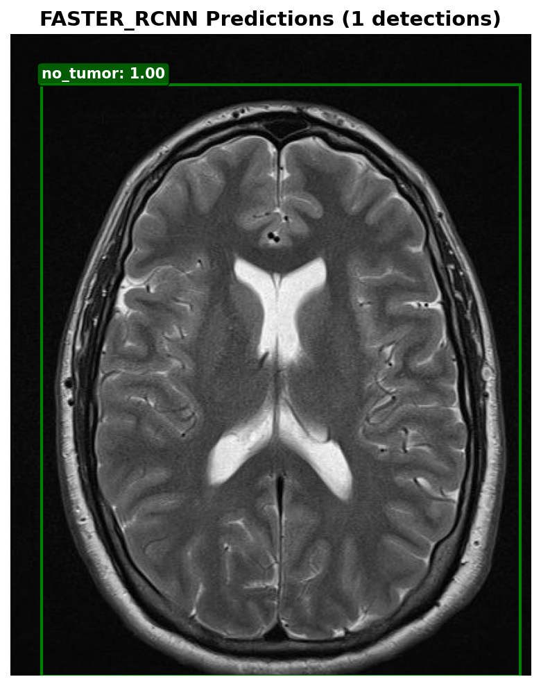
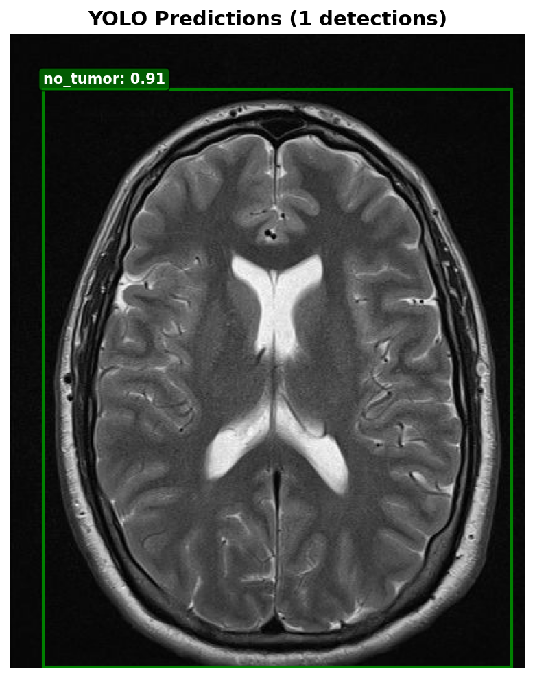
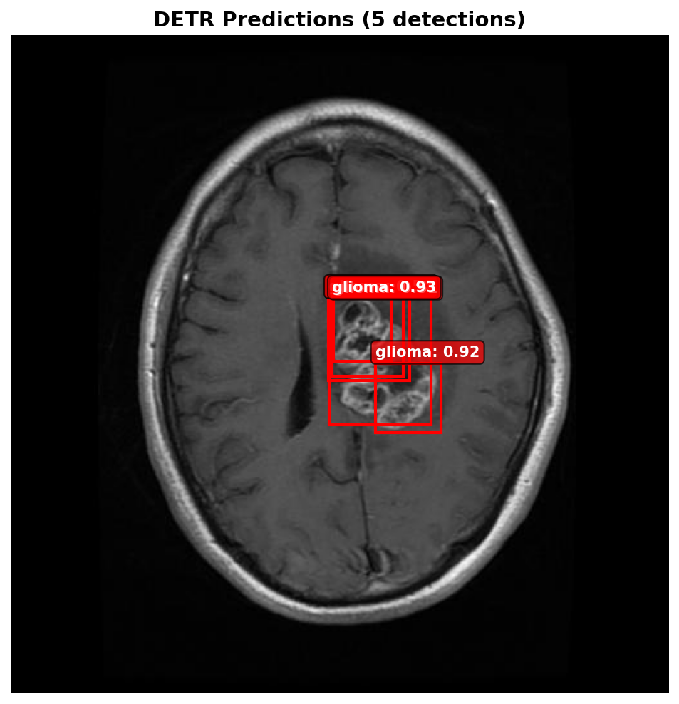
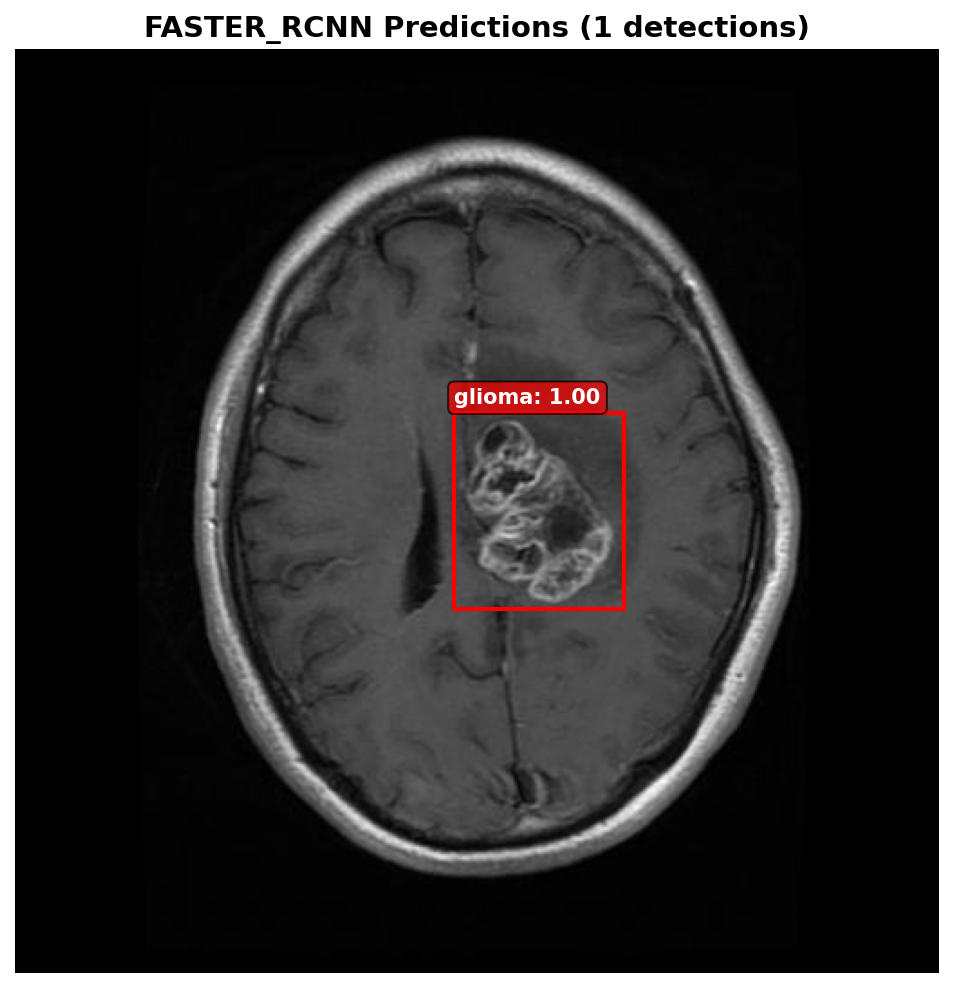

# brain-tumor-detection-MRI
##Overview
This project implements object detection models for identifying brain tumors in MRI images. It uses a dataset from Kaggle with bounding boxes for four classes: glioma, meningioma, pituitary, and no tumor. The pipeline prepares data, performs EDA, trains models (YOLOv8, Faster R-CNN, DETR), evaluates them, and allows predictions on new images.

## Setup

### 1. Prerequisites
- Ensure **Python 3.8+** is installed:
  ```bash
  python --version
  pip install -r requirements.txt

- download the datset from [kaggle](https://www.kaggle.com/datasets/ahmedsorour1/mri-for-brain-tumor-with-bounding-boxes) and put in the
  ```bash
     data/raw
- If you are not training from scratch, download the pre-trained models from [here](www.google/drive.com) extract them to the paths below:
  ```bash
     src/runs/detect/mri_yolo_v2/weights/best.pt
     src/checkpoints/detr/final_model.pth
     output/faster_rcnn_*/model_final.pth
- paht configuration note: The project is done in the serve so for local setup adjust the path accordingly. then for exection go to the project directory
     ```bash
       cd /project directory

- for prediction run:
  ```bash
     predict.py imgpath --models all
- for preprocessing/training/evaluation/comparison use the pipeline.py as you require based on the argument setup
  ```bash
    pipeline.py


## Sample Predictions

### gg (22)

<table style="width:100%; border:none;">
<tr>
  <td width="25%" align="center">
    <strong>Original</strong><br>
    
  </td>
  <td width="25%" align="center">
    <strong>DETR</strong><br>
    
  </td>
  <td width="25%" align="center">
    <strong>Faster R-CNN</strong><br>
    
  </td>
  <td width="25%" align="center">
    <strong>YOLO</strong><br>
    
  </td>
</tr>
</table>

<br>

### image(173)

<table style="width:100%; border:none;">
<tr>
  <td width="25%" align="center">
    <strong>Original</strong><br>
    
  </td>
  <td width="25%" align="center">
    <strong>DETR</strong><br>
    
  </td>
  <td width="25%" align="center">
    <strong>Faster R-CNN</strong><br>
    
  </td>
  <td width="25%" align="center">
    <strong>YOLO</strong><br>
    
  </td>
</tr>
</table>

<br>

### Tr-gl_1295

<table style="width:100%; border:none;">
<tr>
  <td width="25%" align="center">
    <strong>Original</strong><br>
    
  </td>
  <td width="25%" align="center">
    <strong>DETR</strong><br>
    
  </td>
  <td width="25%" align="center">
    <strong>Faster R-CNN</strong><br>
    
  </td>
  <td width="25%" align="center">
    <strong>YOLO</strong><br>
    
  </td>
</tr>
</table>
