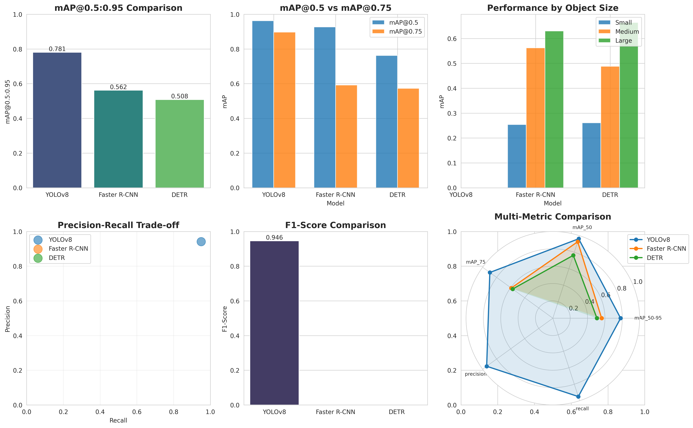

# brain-tumor-detection-MRI
##Overview
This project implements object detection models for identifying brain tumors in MRI images. It uses a dataset from Kaggle with bounding boxes for four classes: glioma, meningioma, pituitary, and no tumor. The pipeline prepares data, performs EDA, trains models (YOLOv8, Faster R-CNN, DETR), evaluates them, and allows predictions on new images.

## Setup

### 1. Prerequisites
- Ensure **Python 3.8+** is installed:
  ```bash
  python --version
  pip install -r requirements.txt

- download the datset from [kaggle](https://www.kaggle.com/datasets/ahmedsorour1/mri-for-brain-tumor-with-bounding-boxes) and put in the
  ```bash
     data/raw
- If you are not training from scratch, download the pre-trained models from [here](www.google/drive.com) extract them to the paths below:
  ```bash
     src/runs/detect/mri_yolo_v2/weights/best.pt
     src/checkpoints/detr/final_model.pth
     output/faster_rcnn_*/model_final.pth
- paht configuration note: The project is done in the serve so for local setup adjust the path accordingly. then for exection go to the project directory
     ```bash
       cd /project directory

- for prediction run:
  ```bash
     predict.py imgpath --models all
- for preprocessing/training/evaluation/comparison use the pipeline.py as you require based on the argument setup
  ```bash
    pipeline.py


## Sample Predictions


### gg (22)

<table style="width:100%; border:none;">
<tr>
  <td width="33%" align="center">
    <strong>DETR</strong><br>
    
  </td>
  <td width="33%" align="center">
    <strong>Faster R-CNN</strong><br>
    
  </td>
  <td width="33%" align="center">
    <strong>YOLO</strong><br>
    
  </td>
</tr>
</table>

<br>

### No Tumor : image(173)

<table style="width:100%; border:none;">
<tr>
  <td width="33%" align="center">
    <strong>DETR</strong><br>
    
  </td>
  <td width="33%" align="center">
    <strong>Faster R-CNN</strong><br>
    
  </td>
  <td width="33%" align="center">
    <strong>YOLO</strong><br>
    
  </td>
</tr>
</table>

<br>

### Tr-gl_1295

<table style="width:100%; border:none;">
<tr>
  <td width="33%" align="center">
    <strong>DETR</strong><br>
    
  </td>
  <td width="33%" align="center">
    <strong>Faster R-CNN</strong><br>
    
  </td>
  <td width="33%" align="center">
    <strong>YOLO</strong><br>
    
  </td>
</tr>
</table>


## Model Comparison

We evaluated the three trained models (YOLOv8, Faster R-CNN, DETR) on the same validation set using standard COCO-style metrics (mAP@0.5:0.95, mAP@0.5, mAP@0.75, precision, recall, F1-score, and performance across object sizes).



### Key Takeaways

- **YOLOv8 is the clear winner in overall performance**
  - Highest mAP@0.5:0.95 → **0.781**
  - Highest mAP@0.5 → **0.964**
  - Highest F1-score → **0.946**
  - Best precision-recall trade-off (very high precision and recall)
  - Strong multi-metric radar chart dominance

- **Faster R-CNN performs second best but lags significantly**
  - mAP@0.5:0.95 → **0.562** (28% lower than YOLOv8)
  - Noticeably weaker on small objects (very low mAP for small lesions)
  - Moderate performance on medium/large objects

- **DETR shows the weakest quantitative results in this setup**
  - Lowest mAP@0.5:0.95 → **0.508**
  - Lowest mAP@0.5 → **0.766**
  - Lowest F1-score
  - Struggles especially with medium and large objects compared to the others

- **Object size sensitivity**
  - All models perform best on **large** objects
  - **Small** objects are very challenging (mAP < 0.3 for all models)
  - YOLOv8 maintains the best balance across small/medium/large

- **Practical recommendation**
  - For real-world MRI brain tumor detection → **YOLOv8** offers the best combination of accuracy, speed, and robustness
  - Faster R-CNN may still be useful if highest possible precision on larger lesions is critical and inference speed is not a concern
  - DETR underperformed in this training/evaluation setup — may benefit from longer training, better hyperparameter tuning, or more data

- Detailed metrics, logs, and additional plots are available in the `results/` folder.

